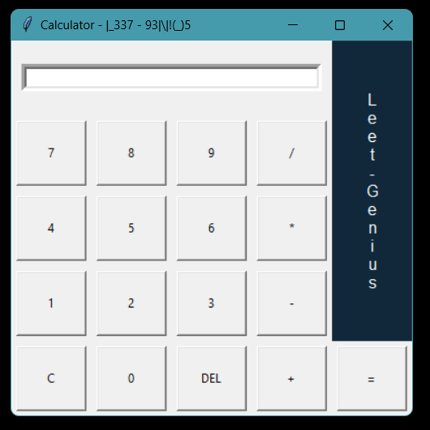

Thank you for clarifying. In that case, you should use `calculator-leetgenius.py` as the filename when running the application. Here's the corrected section for running the application:

```bash
python calculator-leetgenius.py
```

I'll update the README and CHANGELOG accordingly.

**README.md**

# Calculator-Genius

This is a simple calculator application named Calculator-Genius built using Python's Tkinter library. It provides basic arithmetic operations such as addition, subtraction, multiplication, and division. The calculator also supports clearing the display and deleting the last character entered.

## Features

- Addition, subtraction, multiplication, and division operations
- Clear display button (C)
- Delete last character button (DEL)
- Error handling for invalid expressions

## Usage

1. Run the application by executing the Python script.
2. Enter numbers and perform arithmetic operations by clicking on the respective buttons.
3. Use the "=" button to display the result.
4. Use the "C" button to clear the display.
5. Use the "DEL" button to delete the last character.

## Requirements

- Python 3.x
- Tkinter library (usually comes pre-installed with Python)

## How to Run

```bash
python calculator-leetgenius.py
```

## Screenshot



